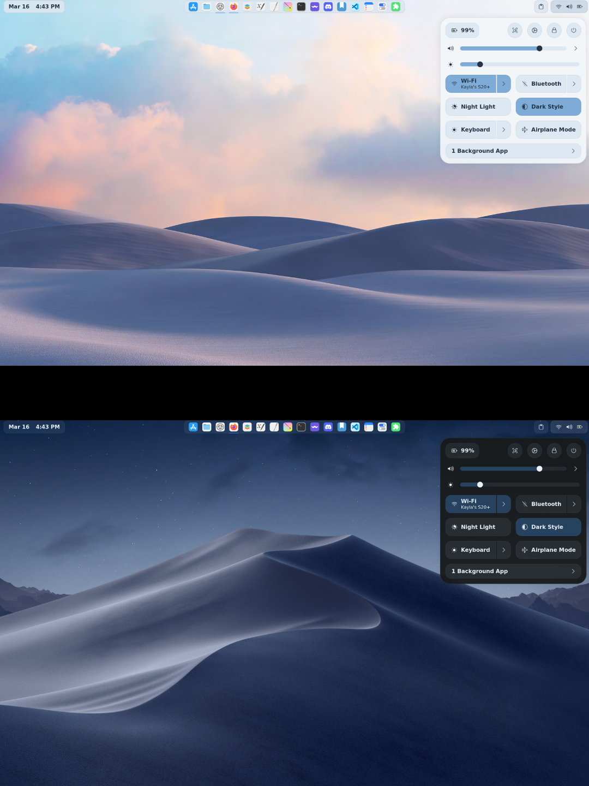

# lucianmonroe.github.io
# Install the wallpapers and icon-themes.zip for quick acsess to the downloads

# To make gnome software work use this : 
It looks like you're missing a few essential "glue" packages that GNOME Software needs to actually talk to the internet and parse the app data. Since `killall` and `appstream-util` aren't found, your installation is a bit "too" minimal right now.

Let's get the necessary tools installed and fix the background process.

### 1. Install Missing Utilities

You need `psmisc` (for the `killall` command) and `appstream-glib` (for the metadata tool). Run this:

```bash
sudo xbps-install -S psmisc appstream-glib

```

### 2. The Correct "Nuclear" Reset

Since `gnome-software --verbose` didn't show anything, the process might be hung in the background. Do this exactly:

1. **Kill the process** (now that you have `killall`):
```bash
killall gnome-software

```


2. **Clear the app data AND the internal database**:
```bash
rm -rf ~/.cache/gnome-software
rm -rf ~/.local/share/gnome-software

```


3. **Force the AppStream refresh**:
```bash
sudo appstream-util refresh-cache --force

```


### 3. Check for the Flatpak Plugin

You mentioned it usually uses Flatpak. On Void, the plugin is a separate package. If this is missing, GNOME Software will be a "ghost town." Ensure it's there:

```bash
sudo xbps-install -S gnome-software-plugin-flatpak

```

### 4. Test the Search Connection

Now, run GNOME Software again. It will take a minute to "re-index" Flathub:

```bash
gnome-software --verbose

```

**Keep an eye on the terminal output.** Look for any lines that say:

* `flatpak: failed to load...`
* `appstream: no data found...`

If you see those, it usually means your Flathub "remote" is added but hasn't actually downloaded the metadata yet. You can force that with:

```bash
flatpak update --appstream

```

It’s a great feeling when those clicks finally start firing! You’ve essentially built a custom sound engine on a minimalist "rolling" system—not a small feat.

Here is the complete summary of the steps we took to get **Keyboard Sounds** running on **Void Linux (GNOME 48.5/49)**.

---

## 🛠️ The Ultimate "Cool Sounds" Setup Guide

### Phase 1: Install Build Tools & Libraries
Because Void Linux is minimal, you first need the "blueprints" to compile the sound engine from source code.
```bash
sudo xbps-install -S base-devel python3-devel kernel-libc-headers \
SDL2-devel SDL2_mixer-devel SDL2_image-devel SDL2_ttf-devel \
freetype-devel libpng-devel portmidi-devel python3-tkinter
```

### Phase 2: Install the Python Package Manager
You need `pipx` to install the tool in an isolated "bubble" so it doesn't break your system.
```bash
sudo xbps-install -S python3-pipx
```

### Phase 3: Build the Sound Engine
This part takes the longest because it compiles the `pygame` and `evdev` libraries specifically for your hardware.
```bash
pipx install keyboardsounds --pip-args="pygame-ce"
```

### Phase 4: Configure the "Path"
You must tell your terminal where the new `kbs` command lives.
1. Run this: `pipx ensurepath`
2. Then refresh your shell: `source ~/.bashrc`
3. Verify it works: `kbs --version` (It should return a version number like **6.4.3**).

### Phase 5: Fix System Permissions
Wayland and GNOME require your user to have permission to "hear" the keyboard across different apps.
1. Add your user to the input group: `sudo gpasswd -a $USER input`
2. **CRITICAL:** You must **Log Out and Log Back In** for this to apply.

### Phase 6: The GNOME Extension
1. Install **Extension Manager** from the software store or via terminal: `sudo xbps-install -S extension-manager`.
2. Disable version checking (since you are on GNOME 48.5 and the extension is for 49):
   ```bash
   gsettings set org.gnome.shell disable-extension-version-validation true
   ```
3. Open **Extension Manager**, search for **Keyboard Sounds**, and turn it **ON**.

---

## 📋 Summary Table of Commands

| Action | Command |
| :--- | :--- |
| **Fix Broken Libs** | `sudo xbps-install -Suv` |
| **Check Version** | `kbs --version` |
| **Stop All Sounds** | `pkill buckle` or `pkill kbs` |
| **Adjust Volume** | Use the keyboard icon in the GNOME Top Bar |
| **Run Manually** | `kbs start` |

---

## 💡 What can I do for you next?
Now that the core system is working, would you like me to find some **custom sound packs** (like Minecraft, Lego, or Star Wars) and show you exactly where to paste them so they show up in your menu?
